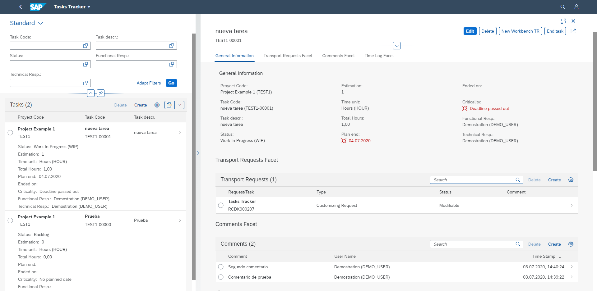

[

# Tasks Tracker for SAP

***Note: Netweaver release 7.50 or higher is required and it isn't dependent for HANA Databases. (it means a lot of limitations of CDS annotations)***

Tasks Tracker for SAP is a simple tool to manage tasks for projects, based on Fiori list report and CDS based on BOPF.

## Installation

Create a package to import the repository.

Importing the project with [abapGit](https://docs.abapgit.org/) will generate the corresponding services, which you need to activate with Maintain Service transaction (/IWFND/MAINT_SERVICE) and assign the alias.

Import also creates a BC Set ZTT_CONFIG, importing it will generates the semantic object entry in /UI2/V_SEMOBJC and creates the Fiori catalog and group ZTASKS_TRACKER with corresponding tiles and target mappings.

To access to applications, you need to create a role for catalog and group, but you can import the role [from this repository](/jrodriguez-rc/abap-tasks-tracker/tree/master/roles)

With all those steps done, you can access to applications from your Fiori Launchpad
